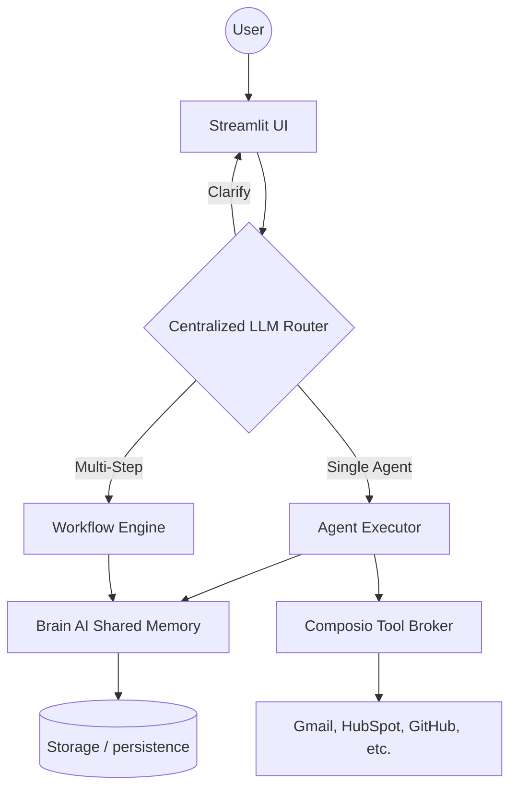

# 🧠 Pinnasys Nexus AI — The Ultimate AI Workforce Orchestrator

Pinnasys Nexus AI is a high-performance, multi-agent orchestration platform designed to automate complex business workflows. Building upon a robust foundation of specialized AI agents, it integrates real-time tool execution (Gmail, HubSpot, GitHub, etc.), centralized LLM-based routing, and persistent memory to serve as a complete AI workforce.

---

## 🚀 Key Features

- **Centralized LLM Router**: An intelligent "brain" that analyzes user intent to decide between a single specialized agent, a multi-step workflow, or a clarification request.
- **Tool-Augmented Agents**: 12+ specialized agents empowered with live system access via Composio (Gmail, HubSpot, Sheets, GitHub, Slack, Tavily Research).
- **Brain AI Memory**: A shared, persistent memory layer that builds context across all agents and workspaces, enabling proactive assistance and personalized interactions.
- **Google Auth Runtime**: Secure, production-ready authentication and session management integrated directly into the agent execution loop.
- **Persistence Hardening**: Robust database layer using SQLAlchemy and Alembic for reliable migrations and multi-tenant workspace isolation.
- **Adaptive Onboarding**: A dynamic quiz engine that extracts initial knowledge to populate the Brain AI from the very first interaction.

---

## 🏗️ Architecture



---

## 🤖 The AI Workforce (Specialized Agents)

| Agent | Role | Focus |
| :--- | :--- | :--- |
| **Penn** | AI Copywriter | Ad copy, landing pages, and long-form content. |
| **Seomi** | SEO Specialist | Keyword research, audits, and content strategy. |
| **Milli** | Sales Assistant | Cold outreach, lead nurturing, and CRM sync. |
| **Soshie** | Social Media Manager | Platform-specific content and viral planning. |
| **Cassie** | Customer Support | Draft replies, FAQ creation, and ticket handling. |
| **Strat** | Business Strategist | SWOT analysis, growth plans, and market entry. |
| **Dexter** | Data Analyst | KPI tracking, trend analysis, and sales reports. |
| **Buddy** | Virtual Assistant | Scheduling, research, and admin automation. |
| **Remy** | Recruiter | JD writing, screening, and interview planning. |
| **Emmie** | Email Marketer | Campaigns, sequences, and newsletters. |
| **Vizzy** | Design Advisor | Brand palettes, briefs, and UI/UX guidance. |
| **Finn** | Finance Advisor | Budgeting, summaries, and cash flow strategy. |

---

## ⚙️ Core Workflows (Multi-Step Chains)

- **Marketing Campaign**: Copywriter → SEO → Social Media.
- **Lead Capture Sync**: Sales (extract) → HubSpot (CRM) → Data Analyst (Sheets).
- **Research & Outreach**: Assistant (Research) → Copywriter (Draft) → Assistant (Send via Gmail).
- **Email Triage**: Assistant (Review/Summarize) → Assistant (Draft Replies).
- **Competitor Insight**: Strategist (Research) → Copywriter (Report).

---

## 🛠️ Tech Stack

- **Logic**: Python 3.10+
- **Frontend**: Streamlit
- **Backend**: FastAPI (Rest API support)
- **Database**: PostgreSQL / SQLite (SQLAlchemy + Alembic)
- **Orchestration**: Custom LLM-based Routing Protocol
- **Integrations**: Composio SDK (1.0+)
- **LLM**: GPT-4o-mini / GPT-4o

---

## 📁 Project Structure

```text
nexus_ai/
├── app.py                  # Main Streamlit entrance
├── alembic/                # Database migration history
├── api/                    # FastAPI REST endpoints
├── auth/                   # Google Auth runtime service
├── brain/                  # Shared memory & knowledge extraction
├── helpers/                # Agent personas and tool policies
├── orchestrator/           # Centralized LLM Router & Request Handler
├── storage/                # SQLAlchemy models & repositories
├── tools/                  # Composio tool registry & broker
├── ui/                     # Streamlit component pages
├── workflows/              # Multi-step state machine logic
└── workspace/              # Workspace & cycle management
```

---

## 🚦 Getting Started

### 1. Prerequisites
- Python 3.10+
- OpenAI API Key
- Composio API Key (for tool usage)

### 2. Installation
```bash
git clone https://github.com/abhi6378/Pinnasys-Nexus-AI.git
cd Pinnasys-Nexus-AI
python -m venv venv
source venv/bin/activate  # Windows: venv\Scripts\activate
pip install -r requirements.txt
```

### 3. Configuration
Copy `.env.example` to `.env` and fill in your credentials:
```bash
OPENAI_API_KEY=your_key
COMPOSIO_API_KEY=your_key
DATABASE_URL=sqlite:///./storage/sintra.db
```

### 4. Running the Platform
```bash
streamlit run app.py
```

---

## 💡 Key Operations

- **Auto-Routing**: Just type your request. The system decides if it needs a specialist, a sequence of agents, or more info.
- **Tool Execution**: Agents can proactively request to use tools (e.g. "Send this to HubSpot"). The system handles the connection and validation.
- **Brain Sync**: The system auto-extracts useful facts from every conversation to improve future responses.

---

*Built with ❤️ by the Pinnasys Nexus Team.*
